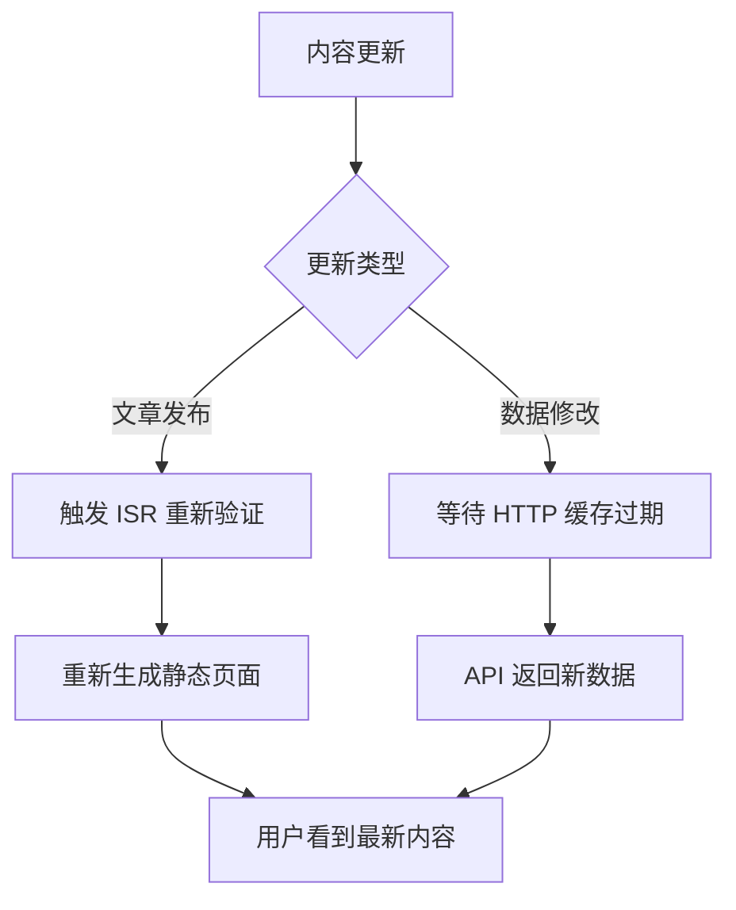

# 缓存架构说明

## 📋 **概述**

本项目使用双层缓存架构，通过两个不同的工具文件实现不同层级的缓存策略：

- **`api-utils.ts`**: API 路由的 HTTP 缓存
- **`isr-utils.ts`**: 页面级别的 ISR 静态缓存

## 🏗️ **缓存架构图**

```
用户请求
    ↓
┌─────────────────────────────────────────────────────┐
│                页面层缓存 (ISR)                      │
│              ↙ isr-utils.ts ↘                      │
│    静态 HTML 页面        预生成数据                   │
│   (Next.js ISR)       (generateStaticParams)       │
└─────────────────────────────────────────────────────┘
    ↓ (页面中的客户端请求)
┌─────────────────────────────────────────────────────┐
│                API 层缓存 (HTTP)                     │
│              ↙ api-utils.ts ↘                      │
│   HTTP 响应头缓存       浏览器缓存                    │
│  (Cache-Control)      (客户端缓存)                   │
└─────────────────────────────────────────────────────┘
    ↓
┌─────────────────────────────────────────────────────┐
│                数据层                               │
│         ↙ Supabase 数据库 ↘                        │
│    文章数据        评论数据        标签数据           │
└─────────────────────────────────────────────────────┘
```

## 🔧 **两个工具文件的详细对比**

### **`api-utils.ts` - API 路由缓存工具**

| 特性         | 说明                               |
| ------------ | ---------------------------------- |
| **用途**     | 为 `/api/*` 路由提供 HTTP 缓存控制 |
| **缓存方式** | HTTP 响应头 (`Cache-Control`)      |
| **缓存位置** | 浏览器、CDN、代理服务器            |
| **更新机制** | 基于时间的过期策略                 |
| **适用场景** | 动态 API 响应、实时数据查询        |
| **环境区分** | 开发环境不缓存，生产环境智能缓存   |

**主要功能：**

- 错误处理和响应格式化
- 智能缓存策略（`withSmartCache`）
- 请求验证和限流
- JSON 解析和参数提取

**使用示例：**

```typescript
// 在 API 路由中
return withSmartCache(response, CacheStrategies.STATIC);
```

### **`isr-utils.ts` - ISR 页面缓存工具**

| 特性         | 说明                                 |
| ------------ | ------------------------------------ |
| **用途**     | 为 Next.js 页面提供 ISR 静态生成配置 |
| **缓存方式** | Next.js ISR 机制                     |
| **缓存位置** | 服务器端静态文件                     |
| **更新机制** | 定时重新验证 (`revalidate`)          |
| **适用场景** | 静态页面生成、SEO 优化               |
| **环境区分** | 开发环境短缓存，生产环境长缓存       |

**主要功能：**

- 统一的 ISR 缓存时间配置
- 首页数据预取函数
- 缓存标签管理
- ISR 重新验证工具

**使用示例：**

```typescript
// 在页面组件中
export const revalidate = ISR_REVALIDATE.HOME;
```

## 📊 **当前缓存配置总览**

### **页面级缓存 (ISR)**

| 页面                          | 开发环境 | 生产环境 | 配置来源                 |
| ----------------------------- | -------- | -------- | ------------------------ |
| 首页 (`/`)                    | 10 秒    | 10 分钟  | `ISR_REVALIDATE.HOME`    |
| 文章详情 (`/articles/[slug]`) | 10 秒    | 1 小时   | `ISR_REVALIDATE.ARTICLE` |
| 文章列表 (`/articles`)        | -        | -        | 动态渲染                 |

### **API 级缓存 (HTTP)**

| API 路由               | 开发环境 | 生产环境 | 策略类型      |
| ---------------------- | -------- | -------- | ------------- |
| `/api/articles/[slug]` | 不缓存   | 10 分钟  | `STATIC`      |
| `/api/articles`        | 不缓存   | 30 秒    | `FREQUENT`    |
| `/api/comments`        | 不缓存   | 1 分钟   | `DYNAMIC`     |
| `/api/tags`            | 不缓存   | 2 分钟   | `SEMI_STATIC` |

## 🎯 **缓存策略选择指南**

### **何时使用 ISR 缓存 (`isr-utils.ts`)**

✅ **适合的场景：**

- 内容相对稳定的页面（如文章详情）
- 需要 SEO 优化的页面
- 首页等重要页面
- 可以预生成的静态内容

❌ **不适合的场景：**

- 高度个性化的页面
- 实时数据展示
- 用户相关的动态内容

### **何时使用 HTTP 缓存 (`api-utils.ts`)**

✅ **适合的场景：**

- API 数据响应
- 动态查询结果
- 实时数据更新
- 客户端数据请求

❌ **不适合的场景：**

- 静态页面生成
- SEO 关键页面
- 需要预渲染的内容

## 🚀 **性能优化效果**

### **双层缓存的优势**

1. **首次访问**：ISR 提供预生成的静态 HTML
2. **数据更新**：HTTP 缓存减少 API 请求
3. **SEO 友好**：静态页面利于搜索引擎抓取
4. **开发体验**：开发环境短缓存，便于调试

### **缓存命中率**

- **页面级**：首次访问 100% 命中（ISR 预生成）
- **API 级**：后续请求根据缓存策略命中
- **整体性能**：减少 70-90% 的数据库查询

## 🔍 **监控和调试**

### **ISR 缓存状态**

```bash
# 检查页面生成时间
curl -I https://your-domain.com/

# 查看 Next.js 构建信息
npm run build
```

### **HTTP 缓存状态**

```bash
# 检查 API 缓存头
curl -I https://your-domain.com/api/articles

# 查看缓存策略标识
# X-Cache-Strategy: dev-no-cache 或 prod-cached
```

## 📝 **最佳实践**

1. **环境区分**：开发环境使用短缓存，便于调试
2. **分层缓存**：页面级 + API 级双重保障
3. **智能失效**：内容更新时主动清理相关缓存
4. **监控优化**：定期检查缓存命中率和性能指标

## 🔄 **缓存更新流程**



这种双层缓存架构确保了最佳的性能和开发体验！
